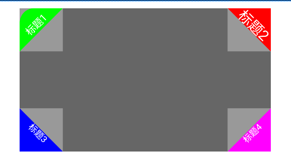

# 圆角图标

### 效果图



### 使用导入方式
[](https://jitpack.io/#SmilingBoy/CornerLabelView)

> Step 1. Add the JitPack repository to your build file
```groovy
allprojects {
		repositories {
			...
			maven { url 'https://jitpack.io' }
		}
	}
```

> Step 2. Add the dependency
```groovy

dependencies {
    implementation 'com.github.SmilingBoy:CornerLabelView:v1.0.0'
}
```

### 使用方式

```xml
  <com.boofb.cornerlabel.CornerLabelView
    android:layout_width="60dp"
    android:layout_height="60dp"
    android:background="#999"
    app:clv_bg_corner_radius="20dp"
    app:clv_bg_color="#0f0"
    app:clv_location_type="TOP_LEFT"
    app:clv_text_padding_v="4dp"
    app:clv_text_size="14dp"
    app:text="标题1" />
```

### 方法介绍

| Attr                 | 含义                 |
| :------------------- | :------------------- |
| clv_bg_color         | 背景颜色             |
| clv_bg_corner_radius | 背景圆角半径         |
| clv_text_color       | 文字颜色             |
| text                 | 文字内容             |
| clv_text_size        | 文字大小             |
| clv_text_padding_v   | 文字与斜边距离       |
| clv_triangle         | 是否是三角形(默认是) |
| clv_location_type    | 角标位置             |

